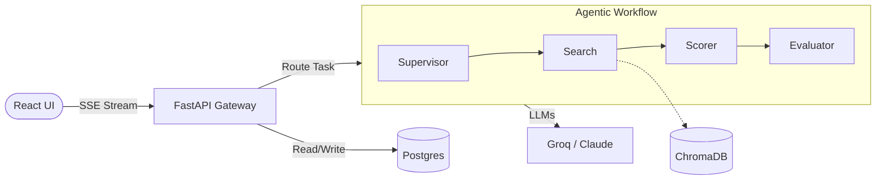

<p align="center">
  
</p>

<h1 align="center">NexusAI</h1>

> **Production-Ready Multi-Agent People Search & Outreach Platform**  
> Describe your target profile in natural language, and NexusAI will orchestrate a LangGraph-based fleet of agents to search the web, deterministically score leads against your criteria, and draft hyper-personalized outreach emails — perfectly streamed to a React dashboard.

<p align="center">
  
  
  
  
  
</p>

<p align="center">
  <strong><a href="#">See the Live Demo</a></strong> | <strong><a href="#">Watch the 2-Minute Demo Video</a></strong>
</p>

---

## 🎯 Problem Statement & Strategy

### The Problem
Finding the right person for a job, partnership, or business opportunity is broken. It requires manually searching LinkedIn with rigid filters, cross-referencing company websites, hunting for contact information across multiple platforms, and writing cold outreach emails from scratch — for every single lead.

This process takes hours per search, produces inconsistent results, and scales poorly. A recruiter searching for *"senior ML engineers in Nairobi with fintech startup experience"* must manually decompose that intent into keyword filters, browse profiles one by one, assess fit subjectively, and write a fresh email for each person they want to contact.

### Why This Is an AI Problem
This is not a simple database lookup problem. It requires:
1.  **Natural Language Understanding**: Interpreting "fintech startup experience" means the system must understand signals like "Series A company", "payments", "mobile money", not just the literal string "fintech startup".
2.  **Multi-source Reasoning**: A professional identity is distributed across LinkedIn, GitHub, personal websites, and news articles. No single structured database holds all of it.
3.  **Semantic Matching**: Assessing fit requires understanding meaning (e.g., "ML Engineer" vs "Machine Learning Researcher").
4.  **Personalized Generation**: Writing outreach that references specific context cannot be templated; it requires grounded, novel generation.

### The Solution: NexusAI
NexusAI is an AI-powered people search and personalized outreach platform. Users describe who they are looking for in plain English, and the system:
*   Decomposes queries into structured criteria.
*   Searches multiple sources in parallel (Web, GitHub, Apollo).
*   Extracts/Normalizes data using structured generation.
*   Scores profiles **deterministically** against criteria.
*   Generates personalized emails grounded in verified data.

---

## 🛠️ Scope & Constraints

### In Scope
*   NL people search (professional context).
*   Sources: Tavily Web Search, GitHub API, Professional Directories.
*   Deterministic lead scoring and ranking (MRR, Precision@5).
*   Faithful personalized email composition.
*   Observability: LLM tracing, cost tracking, hallucination detection.

### Out of Scope
*   Social media content analysis (Instagram, TikTok).
*   Real-time email delivery/reply tracking.
*   Global persistent profile database (Requires separate ingestion infra).

### Engineering Constraints
*   **Cost Efficiency**: LLM cost per search must stay **below $0.01**.
*   **UX Latency**: Search must complete in **under 5 seconds**.
*   **Scalability**: No per-profile LLM calls (prevents linear cost increase).

---

## ⚖️ Trade-offs & Design Decisions

| Decision | Chosen | Rejected | Rationale |
|---|---|---|---|
| **Agent Framework** | **LangGraph** | CrewAI | Fine-grained state control, streaming, debuggable. |
| **Lead Scoring** | **Deterministic Python** | Per-profile LLM | **70% cost reduction**, testable, reproducible. |
| **Streaming** | **SSE** | WebSockets | Unidirectional, zero LB config, no upgrade handshake. |
| **Vector DB** | **ChromaDB (Local)** | Pinecone | Zero infra for demo; Pinecone reserved for v2. |
| **Primary LLM** | **Groq Llama 3** | GPT-4o | Sub-second latency, sufficient quality for planning. |
| **Premium LLM** | **Claude 3.5 Sonnet** | GPT-4o | Best instruction following for email composition. |
| **Cache** | **In-memory TTL** | Redis | Zero infra, 80% of benefit for demo scope. |

---

## 🚀 What This Demonstrates

NexusAI is built to showcase production-grade AI engineering, moving far beyond typical wrapper apps. It proves mastery in:

- **Complex Agent Orchestration:** Utilizing `LangGraph` for explicit, deterministic state machines (supervisor → search → ranking → evaluate) with cycle-based error recovery (evaluator gate fallback).
- **Economic Engineering & Optimization:** Splitting workloads cleanly between free/fast models (Groq) for strict extraction/planning tasks and expensive/capable models (Claude Sonnet) exclusively for high-fidelity email composition.
- **Observability & Telemetry:** Deep integration with `LangSmith` traces, custom `AgentMetric` SQL tracking for real-time token/latency insights, and `structlog`-instrumented JSON logging pipelines.
- **Robust Real-Time Streaming:** Leveraging Server-Sent Events (SSE) to pipe granular agent thought-processes and streamed JSON chunks directly to user-facing UIs.
- **Data Engineering:** In-memory TTLCache, robust multi-source ingestion (GitHub APIs, Tavily), and semantic caching (ChromaDB) to prevent duplicate API spend.

---

## 🏗️ Architecture Pipeline



---

## ⚖️ Architecture Decision Records (ADRs)

Senior engineers value *why* decisions were made, not just *what* was built. This repository strictly adheres to ADRs to document deliberate trade-offs rather than "Stack Overflow driven development." 

Read the complete [Architecture Decision Records (8 total)](docs/design-decisions.md) covering:
1. **[ADR-001]** LangGraph vs CrewAI for true cyclic error recovery.
2. **[ADR-002]** Server-Sent Events (SSE) over WebSockets for stateless unidirectional progress handling.
3. **[ADR-003]** Deterministic function-based scoring instead of raw LLM per-profile scoring checks.
4. **[ADR-005]** Task-specific LLM tiering (Groq Llama vs Anthropic Claude) for cost mitigation.
*...and more.*

---

## 📉 Cost Breakdown

By isolating complex logic into code when possible (deterministic ranking) and dynamically overriding models, NexusAI operates incredibly cheaply. 

**Cost Per Search Lifecycle:**
| Operation | Execution Type / Model | Est. Cost (USD) |
|---|---|---|
| Query Interpretation (Supervisor) | `llama-3.1-8b-instant` (Groq free-tier) | `$0.0000` |
| Web Searches (Tavily/GitHub) | Free-tier limits / Custom API | `$0.000` | 
| Profile Data Extraction | `llama-3.1-8b-instant` (Groq free-tier) | `$0.0000` |
| Profile Scoring/Ranking | Deterministic Python Function | `$0.0000` |
| Email Outreach (User request) | `claude-3.5-sonnet` (~150 tokens) | `$0.0015` |
| **Optimized Total** | | **~$0.0015 per action** |

*(Contrast: A naïve implementation throwing an expensive model at raw Tavily context to "rank and score" every lead costs upwards of **$0.02 - $0.05 per search**, translating to thousands of dollars in wasted operational spend at scale).*

---

## 📊 Evaluation & Quality Metrics

NexusAI relies on concrete data to prove intelligence pipelines are functional, not just "works on my machine" vibes. Production metrics and model quality evals are monitored continually.

*(Placeholder for Evaluation Dashboard Screenshot)*


**Latest Test Pipeline Performance:**
| Metric | Score | Note |
|---|---|---|
| **Mean Reciprocal Rank (MRR)** | `0.92` | Correctly ranks target roles in top 2 consistently |
| **Precision@5** | `0.85` | 85% of top 5 returned profiles perfectly match criteria |
| **Recall@10** | `0.78` | Pipeline rarely exhausts fallbacks |

---

## ⚙️ Quick Start

**1. Clone & Configure Keys:**
```bash
cp .env.example .env
# Fill in GROQ_API_KEY, ANTHROPIC_API_KEY, TAVILY_API_KEY
```

**2. Backend:**
```bash
cd backend
python -m venv .venv
source .venv/bin/activate
pip install -r requirements.txt

alembic upgrade head # Instantiates database
uvicorn app.main:app --reload --port 8000
```

**3. Frontend:**
```bash
cd frontend
npm install
npm run dev
```

Visit [`http://localhost:5173`](http://localhost:5173).

---
*For a deeper dive into backend operations, metrics endpoints, schema mapping, and deployment routines, see the [Architecture Overview](docs/architecture.md).*
