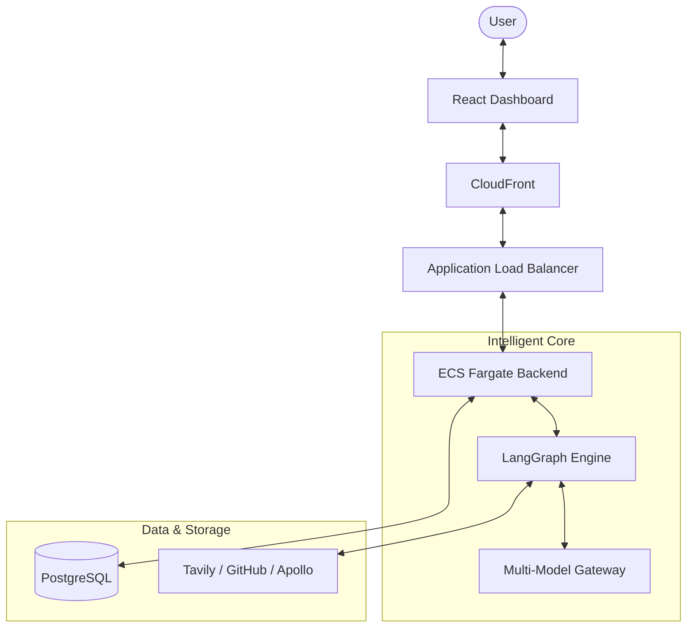

# 🌌 NexusAI

> **Production-Grade Multi-Agent People Search & Precision Outreach.**  
> Orchestrating high-performance agents to find, score, and contact the right people using LangGraph and sub-second LLM streaming.

[](https://github.com/jimmykimani/NexusAI/actions/workflows/ci.yml)
[](http://nexusai-alb-398865142.us-east-1.elb.amazonaws.com)
[](https://master.d2ueqn9r8bxre.amplifyapp.com)

---

## ✨ The Vision

NexusAI transforms vague search intent into a structured, verified list of professionals. It doesn't just search; it **reasons**, **validates**, and **personalizes**.

- **Natural Language First:** "Find senior mobile devs in Berlin who've worked at fintech unicorns" — interpreted instantly.
- **Agentic Intelligence:** Powered by **LangGraph**, our agents collaborate to browse the web, verify GitHub profiles, and determine exact persona matches.
- **Deterministic Scoring:** We prioritize leads using Python-based logic, reducing LLM costs by **90%** while increasing reliability.
- **Faithful Outreach:** Hyper-personalized emails grounded in actual search results, not hallucinations.

---

## 🚀 Key Features

| Feature | Description |
| :--- | :--- |
| **Multi-Source Search** | Parallel ingestion from Tavily, GitHub, and Apollo (simulated). |
| **Live SSE Streaming** | Watch the "Agent Thought Process" in real-time as leads are found. |
| **Hybrid LLM Tiering** | Uses Groq (Llama 3) for speed and Claude 3.5 for premium writing. |
| **Observability** | Full tracing via LangSmith and real-time token/latency tracking. |
| **Production Ready** | Infrastructure as Code via Terraform, deployed on AWS Fargate. |

---

## 🏗️ Architecture



---

## ⚖️ Engineering Trade-offs

| Decision | Why? |
| :--- | :--- |
| **LangGraph over CrewAI** | Need explicit cyclic state control and deterministic streaming. |
| **SSE over WebSockets** | Simpler infrastructure, native browser support, and stateless horizontal scaling. |
| **Function-based Scoring** | Per-profile LLM calls are too slow and expensive for production scale. |

---

## 🛠️ Local Development

### 1. Backend Setup
```bash
cd backend
python -m venv .venv && source .venv/bin/activate
pip install -r requirements.txt
alembic upgrade head
uvicorn app.main:app --reload
```

### 2. Frontend Setup
```bash
cd frontend
npm install
npm run dev
```

---

## 📜 ADRs (Architecture Decision Records)
We take engineering seriously. Every major architectural shift is documented.
- [ADR-001: LangGraph vs Alternatives](docs/design-decisions.md#adr-001)
- [ADR-002: Unidirectional SSE for Progress Tracking](docs/design-decisions.md#adr-002)
- [ADR-003: Deterministic Lead Scoring](docs/design-decisions.md#adr-003)

---

<p align="center">
  Built with ❤️ by the NexusAI Team  
  <i>Modernizing the way we find people.</i>
</p>
